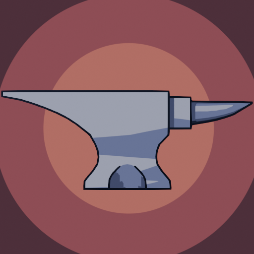

[![Contributors][contributors-shield]][contributors-url]
[![Forks][forks-shield]][forks-url]
[![Stargazers][stars-shield]][stars-url]
[![Issues][issues-shield]][issues-url]
[![MIT License][license-shield]][license-url]

<!-- PROJECT LOGO -->
 

  <a href="https://github.com/CoCoSol007/beats-into-shapes">
      

     
  </a>

  <h3 align="center">Beats into Shapes</h3>

  

     
    <b>Beats into Shape</b> is our submission to <a href="https://fsfe.org/activities/yh4f/">Youth Hacking 4 Freedom</a>. 
      
    We decided to craft a unique rhythm game where you forge items from the very beginning of the process.

  

---

<!-- TABLE OF CONTENTS -->

  
Table of Contents

  <ol>
    <li>
      <a href="#download-links">Download Links</a>
    </li>
    <li>
      <a href="#images">Images</a>
      <ul>
        <li><a href="#level-1-selection">Level 1 (Selection)</a></li>
        <li><a href="#level-2-heating">Level 2 (Heating)</a></li>
        <li><a href="#level-3-forging">Level 3 (Forging)</a></li>
        <li><a href="#level-4-cooling">Level 4 (Cooling)</a></li>
        <li><a href="#trophies-menu">Trophies</a></li>
      </ul>
    </li>
    <li><a href="#gameplay">Gameplay</a></li>
    <li><a href="#universe">Universe</a></li>
    <li>
      <a href="#use-case">Use Case</a>
      <ul>
        <li><a href="#entertainment-with-engaging-music">Entertainment with Engaging Music</a></li>
        <li><a href="#reusable-and-generic-code">Reusable and Generic Code</a></li>
        <li><a href="#free-to-use-assets">Free-to-Use Assets</a></li>
      </ul>
    </li>
    <li><a href="#documentation">Documentation</a></li>
    <li><a href="#tutorial-levels-one-by-one">Tutorial Level by Level</a></li>
    <li><a href="#our-team">Our Team</a></li>
    <li><a href="#music">Music</a></li>
  </ol>

## Download Links
  
| Platform | Link |
|----------|------|
| Play Online |  |
| Windows |  |
| Linux |  |
| Mac (Beta) | [-999999?style=for-the-badge&logo=apple&logoColor=white)](https://github.com/CoCoSol007/beats-into-shapes/releases/download/release/beats-into-shapes-MacOS.zip) |

## Images

### Level 1 (selection)

### Level 2 (heating)

### Level 3 (forging)

### Level 4 (cooling)

### Trophies menu

## Gameplay

In **Beats into Shape**, you play as a smith in your forge, crafting objects in rhythm with the music. The game features 4 levels, each representing a crucial step in creating a flawless metallic object. Stay in sync with the beat to successfully forge your items and progress through the levels.

## Universe

In a world where music and nature intertwine, there exists a hidden valley named Harmony. At the heart of this valley lies the Ethereal Forge, a place of creation where blacksmiths work in harmony with the natural rhythms of music. Eirik, a young blacksmith, inherits this forge and discovers the fulfilling craft of blacksmithing.

Play as the hero and learn step-by-step how to forge weapons in a chill, relaxed environment.

## Use Case

### Entertainment with Engaging Music

**Beats into Shape** aims to provide players with a unique and entertaining experience where they can immerse themselves in the rhythmic art of blacksmithing. By syncing their actions to the beat of captivating music, players can enjoy a relaxing yet engaging gameplay experience. The combination of crafting and rhythm challenges keeps the game interesting and enjoyable, ensuring players are both entertained and absorbed in the world of Harmony.

### Reusable and Generic Code

Our game is designed with a generic and reusable code structure that can be adapted for other rhythm-based games. This flexibility allows developers to easily modify and expand the game mechanics, integrate new musical elements, and create diverse rhythm-based experiences. The codebase is well-documented and modular, ensuring that future projects can leverage the foundational work done in **Beats into Shape** for innovative and exciting new rhythm games.

### Free-to-Use Assets

All the assets in **Beats into Shape** are completely free for any use, as they are created entirely by our talented team members CoCoSol and Edmond. This ensures that the game's visual and audio elements can be reused or adapted for other projects without any legal restrictions, fostering a spirit of open collaboration and creativity within the game development community. You can find all the assets [here](/assets/).

## Documentation

See all the project documentation [here](/docs)

See all the SVG images and sketches [here](https://www.figma.com/design/i4OFqWsSMmk0AW6OUtyf3B/Beats-into-shapes?t=ICflNE9DRQtmYzKb-1)

See all about our license [here](/LICENSE)

## Tutorial levels one by one

See all the tutorial levels one by one by clicking on the [link](/docs/tuto.md).

## Our Team

Thank you to all collaborators for your hard work and dedication.

- **CoCo_sol**: Programmer - Art
- **Plouf-Charles**: Programmer
- **Tipragot**: Programmer
- **Edmond**: Art
- **Bijunoka**: Art

### Music

A special thanks to the music creator who made the game even better.

- [Take A Break (Cozy Ambient Lofi) - FASSounds](https://pixabay.com/music/beats-take-a-break-cozy-ambient-lofi-199738) (menu)
- [Good Night - FASSounds](https://pixabay.com/music/beats-good-night-160166) (cooling)
- [Slow Down - Avanti](https://freetouse.com/music/avanti/slow-down) (selection)
- [LoFi Chill (Medium Version) - BoDleasons](https://pixabay.com/music/beats-lofi-chill-medium-version-159456) (heating)
- [Jazz Cafe - FASSounds](https://pixabay.com/music/beats-jazz-cafe-112190) (forging)

[contributors-shield]: https://img.shields.io/github/contributors/cocosol007/beats-into-shapes.svg?style=for-the-badge
[contributors-url]: https://github.com/cocosol007/beats-into-shapes/graphs/contributors
[forks-shield]: https://img.shields.io/github/forks/cocosol007/beats-into-shapes.svg?style=for-the-badge
[forks-url]: https://github.com/cocosol007/beats-into-shapes/network/members
[stars-shield]: https://img.shields.io/github/stars/cocosol007/beats-into-shapes.svg?style=for-the-badge
[stars-url]: https://github.com/cocosol007/beats-into-shapes/stargazers
[issues-shield]: https://img.shields.io/github/issues/cocosol007/beats-into-shapes.svg?style=for-the-badge
[issues-url]: https://github.com/cocosol007/beats-into-shapes/issues
[license-shield]: https://img.shields.io/github/license/cocosol007/beats-into-shapes.svg?style=for-the-badge
[license-url]: https://github.com/cocosol007/beats-into-shapes/blob/master/LICENSE
